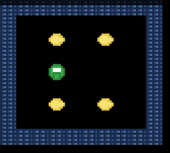

# Supaplex Clone

A faithful, deterministic clone of the classic puzzle game **Supaplex**, written in
TypeScript, bundled with webpack, and rendered to Canvas 2D with procedurally drawn
pixel-art sprites. All levels are original designs; no copyrighted Supaplex assets or
data are used.



This game was created using Deepseek Flash V4 and cost 20 cents to produce.

## Related Supaplex projects

- [Supaplex Sonnet 5](https://github.com/VictorZakharov/supaplex-sonnet5)
- [Neonplex](https://github.com/VictorZakharov/neonplex)
- [Supaplex Luna 56](https://github.com/VictorZakharov/supaplex-luna-56)

## Stack

- TypeScript (strict) — pure, deterministic game core
- webpack 5 — dev server + production bundles
- Vitest + v8 — unit, integration, and determinism tests
- ESLint (flat config) + Prettier
- Canvas 2D — rendering with a pre-rendered sprite atlas

## Commands

Install with npm or pnpm. `npm start` uses port 8080 when available and
automatically selects the next free port if 8080 is already in use.

```bash
npm install       # install dependencies
npm start         # dev server at http://127.0.0.1:8080 (or the next free port)
npm run build     # production bundle to dist/
npm test          # run tests once
npm run test:coverage
npm run lint      # eslint
npm run typecheck # tsc --noEmit
npm run verify    # lint + typecheck + test + build
```

## Playing

Arrow keys or WASD move Murphy. Collect all Infotrons, then walk onto the Base to
complete the level. Avoid Zonks and Snik Snaks. The pause menu (Esc) shows controls.

See [docs/MECHANICS.md](docs/MECHANICS.md) for the full gameplay and engine spec.
